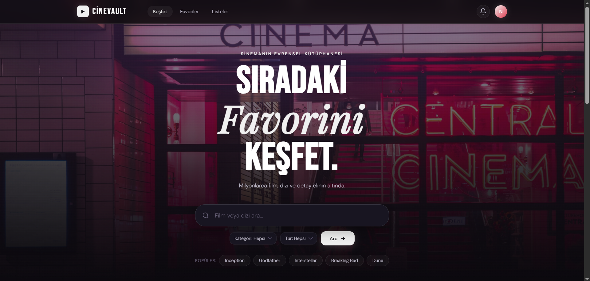

# 🎬 CineVault — Cinematic Movie Discovery & Ecosystem

CineVault is a sophisticated, high-performance web application that enables users to explore millions of films and series while curating personal, persistent movie collections.

---

## About the Project

The CineVault application aims to redefine digital content discovery by merging modern engineering with cinematic aesthetics. Built as a full-stack prototype, it handles complex asynchronous data flows from the OMDb API and provides a robust management system for personal movie libraries.

---

## ✨ Key Features

* **User-Friendly Interface:** Modern, clean, and intuitive design featuring a high-end "Deep Dark" cinematic theme.
* **Real-Time Discovery:** Instantly search through millions of titles with OMDb API integration and live filtering.
* **Collection Management:** Create, rename, and manage bespoke movie folders with full CRUD (Create, Read, Update, Delete) capabilities.
* **Hybrid View Engine:** Seamlessly toggle between a high-impact Grid View and a detailed List View.
* **Data Persistence:** Integrated LocalStorage ensures user favorites and custom collections remain secure across sessions.
* **Responsive Architecture:** Optimized for a flawless experience across mobile, tablet, and desktop devices.

---

## 👥 Roles and Features

### The User Experience

* **Explore & Search:** Access a global library of films with advanced filtering (Genre/Type).
* **Curate Collections:** Organize movies into custom-named folders for specific moods or genres.
* **Follow Favorites:** Mark titles as "Favorites" with a single click for rapid access.
* **Cinematic Details:** View comprehensive movie data including IMDB ratings, plot summaries, and cast information in a dedicated modal.

---

## 🛠️ Technologies Used

| Technology         | Purpose                                                |
| ------------------ | ------------------------------------------------------ |
| Vanilla JavaScript | Core frontend logic and asynchronous state management  |
| Node.js & Express  | Backend server configuration and static file hosting   |
| CSS3 (Modern)      | Advanced design system (Grid, Flexbox, Glassmorphism)  |
| OMDb API           | RESTful integration for real-time movie data           |
| LocalStorage       | Persistence for user-defined collections and favorites |
| NPM                | Dependency management for project environment          |

---

## 📂 Project Structure

```plaintext
omdb-project/
├── assets/                 # Media assets (Images, icons, grain textures)
├── node_modules/           # Project dependencies installed via NPM
├── app.js                  # Core Frontend Logic & API Management
├── index.html              # Main UI structure and DOM elements
├── server.js               # Backend Node.js server configuration
├── style.css               # Modular Cinematic Design System
├── package.json            # Project metadata and script configurations
└── README.md               # Comprehensive project documentation
```

---

## 🚀 Installation & Setup

### Clone the Repository

```bash
git clone https://github.com/nidanursigirta/cinevault.git
cd omdb-project
```

### Install Dependencies

```bash
npm install
```

### Run the Server

```bash
node server.js
```

### Access the App

Open your browser and navigate to:

```
http://localhost:3000
```

(or the port specified in `server.js`)

---

## ✒️ Development Team

**Nidanur Sigirta**
Lead Software Engineer & UI Architect

---

## 🛡️ License

© 2026 CineVault. All rights reserved.

**Engineering the Cinema | Built with Passion**
